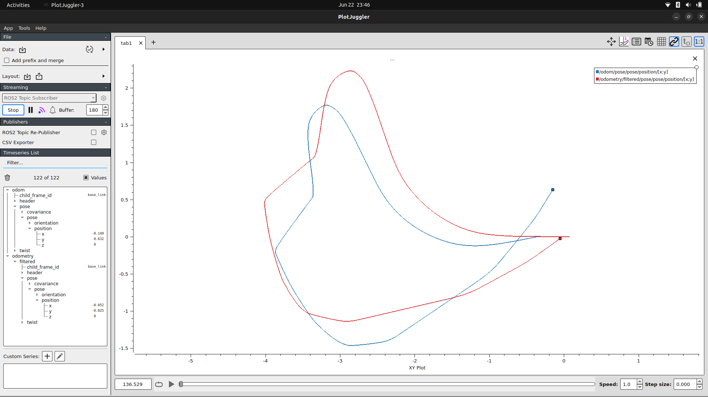
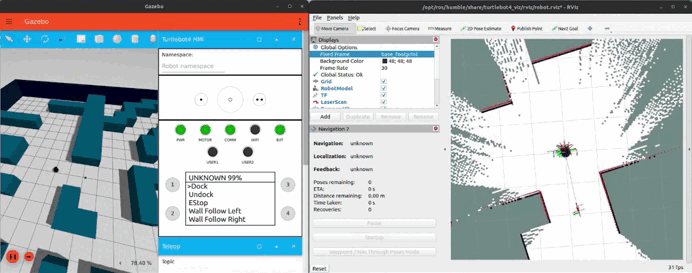
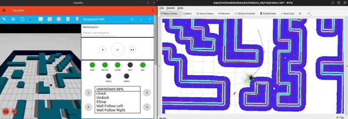

# Turtlebot4 Navigation Sandbox

A ROS 2 package for the TurtleBot4 that contains an Extended Kalman Filter (EKF) node implemented from scratch. It fuses encoder odometry with IMU data. It also includes a waypoint follower node using Nav2.

Use this package as a sandbox for testing Nav2 features.

Additionally, you can add your Ignition Fortress worlds and run the 'slam_toolbox' to map them, taking advantage of the clean localization provided by the EKF.

## Requirements

- **ROS2 Humble**
- **Gazebo Ignition Fortress**

## Prerequisites

Before using this package, you need to install the official TurtleBot4 packages. Follow the installation instructions from the official TurtleBot4 documentation:

🔗 [TurtleBot4 Installation Guide](https://turtlebot.github.io/turtlebot4-user-manual/software/overview.html)

And make sure you have Nav2 and slam_toolbox:

```bash
sudo apt install ros-humble-slam-toolbox
sudo apt install ros-humble-navigation2
sudo apt install ros-humble-nav2-bringup
```

## Package Contents

This package will provide:
- **Localization node: Extended Kalmann Filter (IMU/encoder's odometry)** for TurtleBot4 positioning
- **Path planning with Nav2 (using nav2_params.yaml)** for navigation testing


## Installation

1. Clone this repository into your ROS2 workspace:
```bash
cd ~/your_ros2_ws/src
git clone https://github.com/Alvaro2304/turtlebot4_path_planning.git
```

2. Build the package:
```bash
cd ~/your_ros2_ws
colcon build --packages-select turtlebot4_path_planning
```

3. Source your workspace:
```bash
source ~/your_ros2_ws/install/setup.bash
```

## Usage

**EKF Tuning**

1. Launch the simulation with 'ekf_imu_encoder.cpp' embedded:
```bash
ros2 launch turtlebot4_path_planning turtlebot4_tuning.launch.py
```
2. Plot the filtered odometry (`/odometry/filtered`) while moving the robot. I strongly recommend using **PlotJuggler**.

3. If the result isn’t what you expect, tune the *Q* and *R* matrices in the `ekf_imu_encoder.cpp` node.

   * *Q* is the process noise covariance matrix. It tells how much we trust the model.
   * *R* represents the sensor measurement noise covariance matrices. These indicate how much we trust sensor measurements.
     In both cases, **the smaller the value, the more trust is given**. 



**Mapping(SLAM with slam_toolbox)**

1. Launch the simulation with 'ekf_imu_encoder.cpp' embedded:
```bash
ros2 launch turtlebot4_path_planning turtlebot4_tuning.launch.py
```

2. Launch online asynchronous mapping. Make sure you're using the `mapper_params_online_async.yaml` provided in this package (in this example, the workspace is `/ros2_ws`):
```bash
ros2 launch slam_toolbox online_async_launch.py params_file:=./ros2_ws/src/turtlebot4_path_planning/config/mapper_params_online_async.yaml use_sim_time:=true
```

3. Move around to create the map. Once you're finished, save it. The map will be saved in the directory where you launched the SLAM process.



**Waypoints navigation**

1. Review the configuration in `nav2_params.yaml` (for Nav2 behavior) and `waypoints.yaml` (for the starting pose and waypoints).

2. Launch the simulation with 'ekf_imu_encoder.cpp' embedded:
```bash
ros2 launch turtlebot4_path_planning turtlebot4_tuning.launch.py
```
3. Before starting navigation, make sure to **undock the robot using the HMI** in Ignition.

4. Launch navigation:
```bash
ros2 launch turtlebot4_path_planning turtlebot4_navigation.launch.py
```



## Known Issues

### Gazebo Simulation Issues

**RPLidar not publishing data:**
- **Problem**: The TurtleBot4's RPLidar sensor may not publish any data in Gazebo simulation
- **Solution**: Ensure that Ignition Gazebo is running with GPU acceleration enabled, as the LiDAR plugin uses GPU-based ray casting for simulation
- **How to verify**: Check that your system has proper GPU drivers installed and Ignition is utilizing GPU resources

## Contributing

Contributions are welcome! Please feel free to submit issues, feature requests, or pull requests.

## License

This project is licensed under the Apache License 2.0 - see the [LICENSE](LICENSE) file for details.

## Acknowledgments

- TurtleBot4 development team
- Open Navigation